[](https://app.netlify.com/sites/gatsby-theme-anchor/deploys)

# Gatsby Theme Anchor

<p align="center">
  <a href="https://gatsby-theme-anchor.netlify.com/">
    
  </a>
  <br />
  <i>
    A
    <a href="https://www.gatsbyjs.org/">Gatsby</a>
    Theme to showcase your podcast in
    <a href="https://anchor.fm/">Anchor</a>
  </i>
</p>

### [Live Demo](https://gatsby-theme-anchor.netlify.com/)

## Motivation 🤔

When a podcast starts the most difficult part is sharing it with the rest of world, this Gatsby Theme will help to solve that! The idea behind it is to provide a customizable platform where the podcasters can:

- Have a [Landing page](#landing) with the last episodes of the show and more relevant information.
- Add information about the show inside the [About Page](#About)
- Showcase all the podcast inside the [Podcast Page](#Podcast)
- Possibility to add/edit/remove content using a [CMS view](#CMS)

I recorded a really short podcast in which I talked about this project. So in case you want to know more about it and also listen to my first "real" podcast episode, I leave you the link!

<a href="https://anchor.fm/the-es-podcast/episodes/E01---Gatsby-Theme-Anchor-e4p592">
  
</a>

## Features 🤹

- Gatsby theme 🔥
- Typescript support
- CSS in JS using [Rebass](https://rebassjs.org/)
- Theming with [ThemeProvider](https://www.styled-components.com/docs/advanced)
- Anchor integration
- [Netlify CMS](https://www.netlifycms.org/) integration
- Ready for deployment with [Netlify](https://www.netlify.com/)
- SEO
- Offline Support

**Lighthouse score 📈**

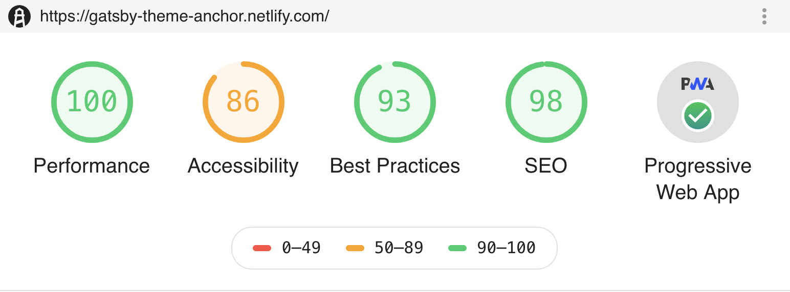

## Screenshot and Design 👩‍🎨

Before jumping into the screenshots I want to thank all these amazing resources that allowed to make it that good ✨:

- The pallete of the site has been generated using [Material Palette](https://www.materialpalette.com/purple/pink).
- The Illustration were taken from [UnDraw](https://undraw.co/)
- The Social Icons are from [Font Awesome](https://fontawesome.com/)
- The Component library used under the hood is [Rebass](https://rebassjs.org/)

### Landing

| Desktop                                                    | Mobile                                                   |
| ---------------------------------------------------------- | -------------------------------------------------------- |
| 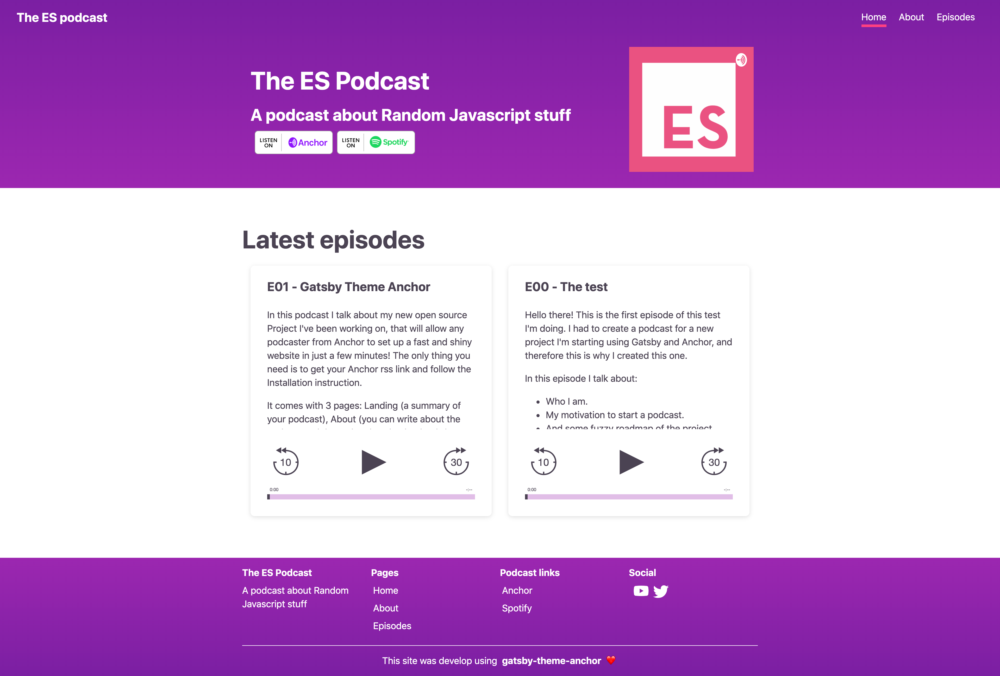 | 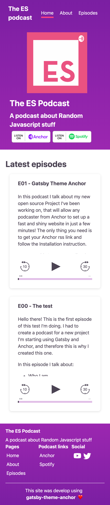 |

### About

| Desktop                                                | Mobile                                               |
| ------------------------------------------------------ | ---------------------------------------------------- |
| 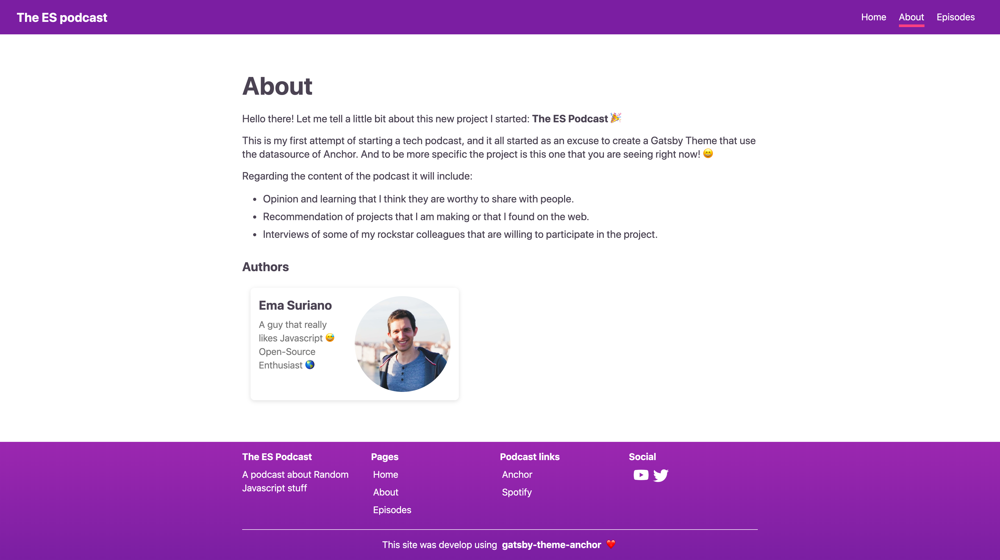 | 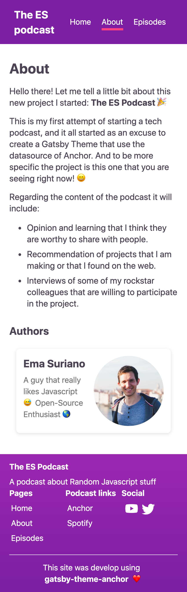 |

### Episodes

| Desktop                                                            | Mobile                                                           |
| ------------------------------------------------------------------ | ---------------------------------------------------------------- |
| 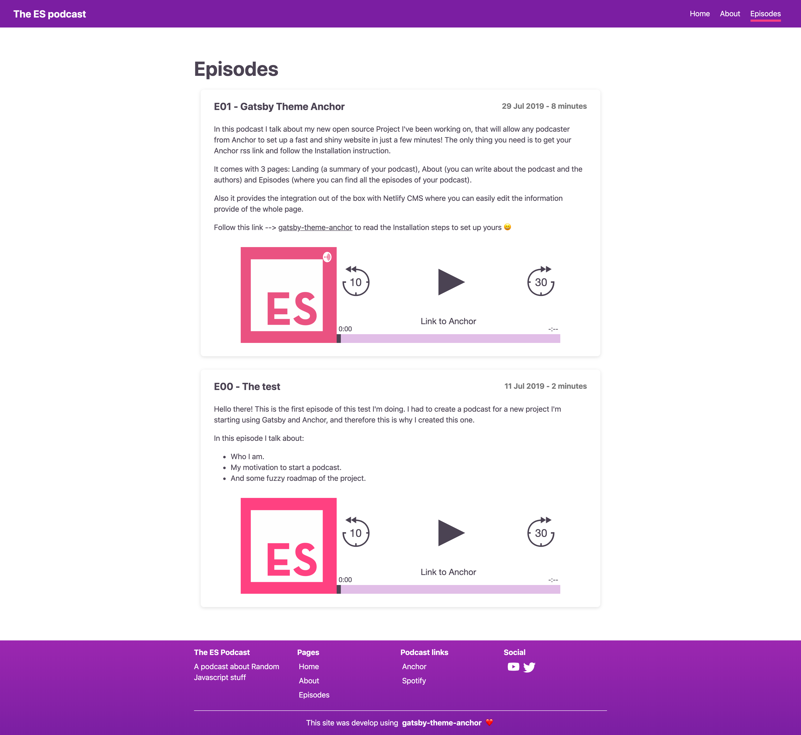       | 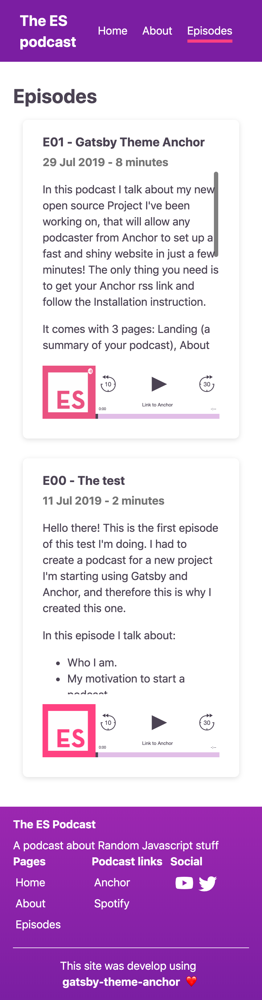       |
| 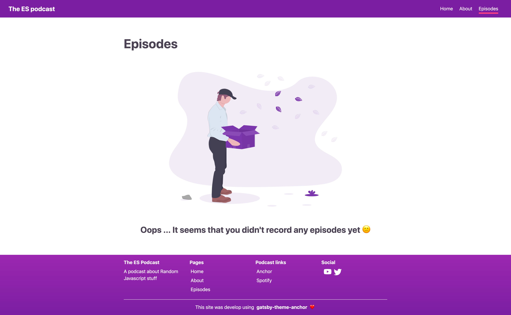 | 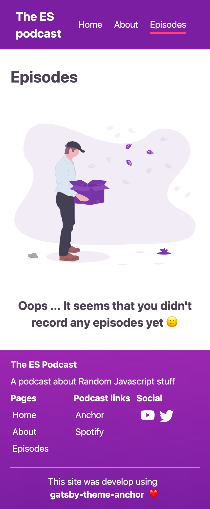 |

### 404

| Desktop                                            | Mobile                                           |
| -------------------------------------------------- | ------------------------------------------------ |
| 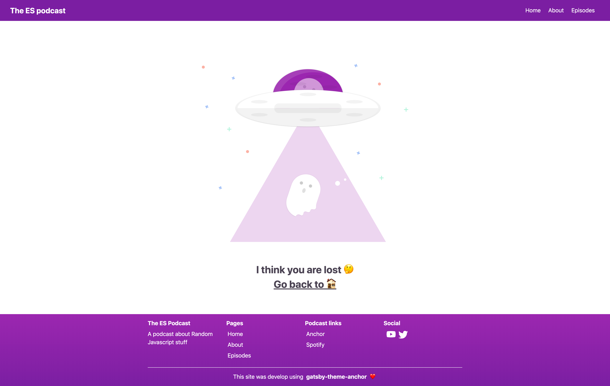 | 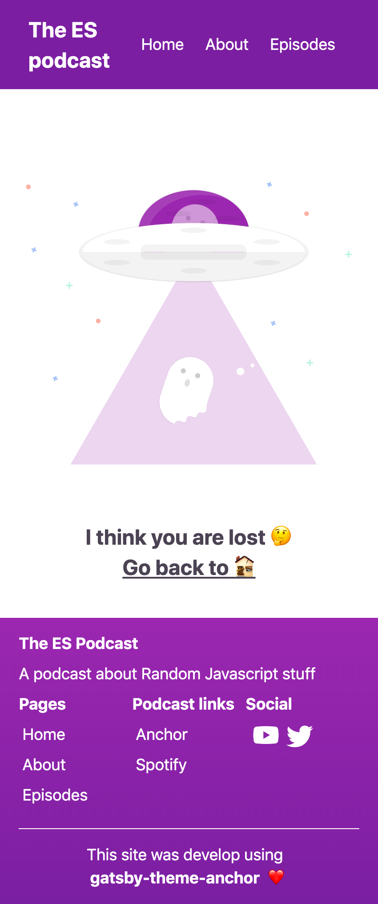 |

### CMS

| Landing                                            | About                                          |
| -------------------------------------------------- | ---------------------------------------------- |
| 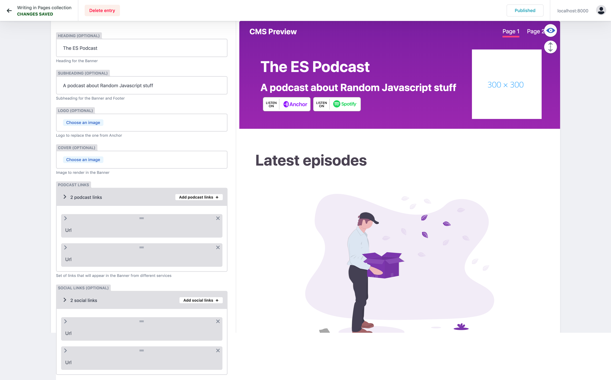 | 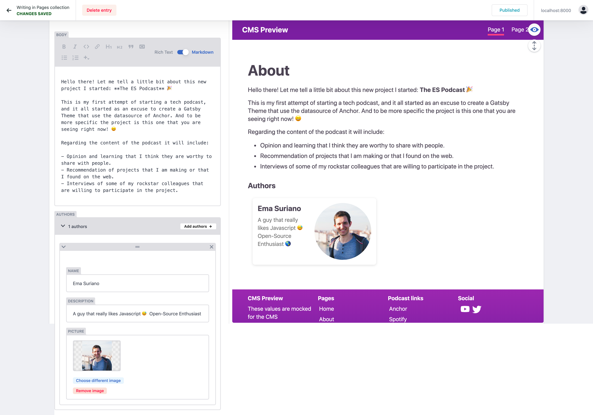 |

## How to Start 👷‍

Given this project use `yarn Workspace` if you download the project you will download the entire project, demo and theme all together. You can always clone the project and remove the additional folder.

In order to avoid confusion, I created a branch called `demo` with only the code to run the example. Go your terminal and run:

```bash
> git clone --single-branch --branch demo https://github.com/EmaSuriano/gatsby-theme-anchor.git
```

This will clone the project with only the example on it. Then you need to install the dependencies and in this case, `gatsby-theme-anchor` will be taken from `npm` and not from the local folder (like `yarn workspace` was doing).

```bash
> yarn #install dependencies
> yarn start #start project
```

After running the project you should be able to go to the [`http://localhost:8000`](http://localhost:8000) and see the [Landing Page](#landing). This means that you set up the theme successfully, now let's jump into the Customization!

## Customization 🎨

## Deploying your site 📦

In order to deploy and enable all the powerful of the CMS I highly recommend using [Netlify](https://www.netlify.com). It's a static website hosting with the capability of synchronizing with your GitHub repository, so then every time you push a new deployment is released!

Please follow this [Step by Step Guide](https://www.netlify.com/blog/2016/09/29/a-step-by-step-guide-deploying-on-netlify/) from the official documentation of Netlify. When you reach to the point of setting the command the output folder, you need to set as command `yarn build` and as output folder `/dist`.

This last step is totally optionally but it's one of my favorite of this setup. As this theme use Netlify CMS you can enable the `Identity` feature inside the deployment configuration that will allow to modify your data through the deployed site by making commit to the repository.

Please follow this [Guide](https://www.netlifycms.org/docs/authentication-backends/) to enable.I already provide a proper `config.yml` inside `/static/admin` folder but you still need to enable from your side. In order to check if everything is working, go to the route `/admin` of your deployed site, there you need to authenticate (you can pick different services in the previous step) and once you are inside the CMS every change you make it will push a commit to the repository. Dispatching a new release of your website 😄

## Trouble Shooting 💥

In order to keep the README short I decided to move this section to a [separate file](./docs/TROUBLESHOOTING.md).

## Contributing 💪

This project is using yarn Workspace in order to be able to run a Gatsby project using the source code of the theme. Follow these steps to run the demo locally:

1.  Clone the repo: `git clone https://github.com/EmaSuriano/gatsby-theme-anchor.git`
2.  Install dependencies: `cd gatsby-theme-anchor && yarn`
3.  Start the demo: `yarn workspace demo start`

## License

MIT.
